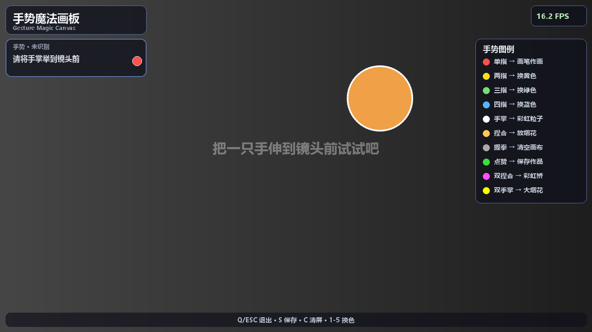

# 手势魔法画板 Gesture Magic Canvas

一个基于摄像头的实时手势识别互动作品：把手举到镜头前，即可用手指作画、
放烟花、召唤彩虹粒子流，握拳清屏、点赞保存——支持**双手同时识别**，
两只手可以同时画画、互相配合放特效。无需任何额外设备，一个普通摄像头就能玩。



## 作品功能

| 手势 | 效果 |
|---|---|
| ☝️ 单指（只伸食指） | **画笔作画**：指尖划过之处留下笔迹 |
| ✌️ 两指 | 画笔换成**黄色** |
| 🤟 三指 | 画笔换成**绿色** |
| 🖖 四指 | 画笔换成**蓝色** |
| 🖐 张开手掌 | **彩虹粒子**跟随五指指尖流动 |
| 🤏 拇指食指捏合 | 在指尖处**绽放一朵烟花** |
| ✊ 握拳保持 1 秒 | **清空画布**（有进度环提示，防止误触） |
| 👍 点赞 | **保存作品**到 `saves/` 文件夹（PNG 图片） |

### 双手玩法（双手同时识别）

| 手势 | 效果 |
|---|---|
| 两只手各自做单手手势 | **各自独立生效**：可以一只手画画、另一只手放烟花/换色/出粒子 |
| 🤏🤏 双手同时捏合 | 两指尖之间拉出一条流动的**彩虹能量桥** |
| 🖐🖐 双手同时张开 | 两手之间绽放**大型多彩烟花** |
| ✊ 任一只手握拳 | 清空画布 |

> 提示：两只手避免长时间前后完全重叠，否则跟踪器可能短暂混淆两只手的身份
> （画面分开后立即恢复）。

键盘快捷键：`Q`/`ESC` 退出 · `S` 保存 · `C` 清屏 · `1`~`5` 换色
（红/黄/绿/蓝/彩虹）

## 快速开始

### 方式一：双击启动（推荐）

双击项目里的 **`启动手势魔法画板.bat`** 即可。

### 方式二：命令行启动

```bash
cd 手势魔法画板
python main.py          # 使用 0 号（默认）摄像头
python main.py 1        # 使用 1 号摄像头（有多个摄像头时）
```

### 首次运行（在其他电脑上）

需要 Python 3.10 及以上版本，先安装依赖：

```bash
pip install -r requirements.txt
```

> 本项目已自带手部关键点模型文件 `models/hand_landmarker.task`，
> 安装好依赖后**完全离线**即可运行，无需联网。

## 技术原理

作品由 4 个 Python 模块组成，全部代码带中文注释，方便学习与讲解：

```
手势魔法画板/
├── main.py              # 主程序：摄像头循环 → 手势识别 → 互动逻辑 → 渲染
├── gestures.py          # 手势识别：21 个关键点 → 8 种手势 + 双手跟踪（几何规则）
├── particles.py         # 粒子系统：烟花爆发、彩虹拖尾（加法混合发光）
├── hud.py               # 界面绘制：标题、多手徽章、图例、进度环（Pillow 渲染中文）
├── models/
│   └── hand_landmarker.task   # MediaPipe 手部关键点模型（约 7.5 MB，离线可用）
├── saves/               # 点赞保存的作品 PNG 存放在这里
├── test_gestures.py     # 手势判定逻辑自测脚本（无需摄像头）
└── 启动手势魔法画板.bat  # Windows 双击启动脚本
```

### 1. 手部关键点检测

使用 Google **MediaPipe HandLandmarker** 模型，每帧从摄像头画面中定位
**21 个手部关键点**（腕、各指关节、指尖），并实时绘制手部骨骼。

### 2. 手势判定（gestures.py）

不依赖第二个模型，而是用**几何规则**从关键点推算手势：

- 以「手腕 → 中指根」的距离作为**手掌尺度**，让所有阈值与镜头远近无关；
- 判断手指是否伸直：手腕到指尖的距离 > 手腕到第二关节的距离 × 1.12；
- 判断捏合：拇指尖与食指尖的距离 < 手掌尺度 × 0.45；
- 综合五指伸直状态与伸出数量，按优先级映射为 8 种手势；
- **防抖**：连续 4 帧相同手势才生效；关键点做指数平滑，笔迹不抖动。

### 2.5 双手跟踪（gestures.py 的 MultiHandTracker）

MediaPipe 每帧输出的多只手没有稳定编号（两只手在结果列表里的顺序可能互换）。
跟踪器用**手腕位置最近邻匹配**把前后帧的手一一对应：每只手拥有独立的
平滑器、防抖历史与画笔状态，因此双手可以同时画画互不干扰，一只手离开
也不影响另一只。

### 3. 粒子特效（particles.py）

粒子先绘制在一张纯黑图层上，再用**加法混合**（`cv2.add`）叠加到摄像头
画面上，亮度饱和处自然过曝发白，产生霓虹发光感。烟花粒子带重力、空气
阻力与随机明暗闪烁。

### 4. 界面叠加（hud.py）

半透明深色面板 + 微软雅黑中文渲染（OpenCV 的 `putText` 不支持中文，
因此使用 Pillow 绘制文字后再合成回画面）。

## 常见问题

| 问题 | 解决办法 |
|---|---|
| 提示"未检测到可用摄像头" | 检查摄像头是否被微信/腾讯会议等软件占用；或有多个摄像头时改用 `python main.py 1` |
| 手势识别不灵敏 | 保证光线充足、手距镜头 40~80 厘米；可微调 `gestures.py` 顶部的阈值参数 |
| 笔迹抖动 | 减小 `gestures.py` 中的 `SMOOTH_ALPHA`（如 0.4），更平滑但延迟略增 |
| 切换手势太迟钝 | 减小 `STABLE_FRAMES`（如 3）；太灵敏误触发则增大（如 5） |
| 画面卡顿 | 关闭其他占用摄像头的程序；或在 `main.py` 中把采集分辨率改为 640×480 |
| 双手靠近/交叉时短暂混淆 | 属正常现象（基于位置匹配），两手分开后立即恢复 |
| 窗口画面太小/太大 | 拖动窗口边缘缩放即可（窗口可自由拉伸） |

## 自测

```bash
python test_gestures.py       # 手势判定与双手跟踪测试（18 项，无需摄像头）
python main.py --fake --smoke # 无摄像头演示模式：合成画面跑 90 帧自检
```

## 作品信息

- 适用课程：数字媒体技术 / 人机交互 / 计算机视觉入门
- 运行环境：Windows + Python 3.10+，普通 USB 摄像头
- 核心依赖：MediaPipe、OpenCV、NumPy、Pillow

## 开源许可

本项目采用 **GPL-3.0** 许可证开源——任何人可以自由使用、修改和分发本项目，
但基于本项目的衍生作品同样必须以 GPL-3.0 开源。详见 [LICENSE](LICENSE)。
